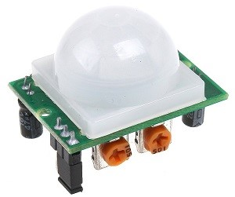

 

### PIR Motion Sensor
<p1>
Los sensores PIR permiten detectar movimiento, casi siempre se usan para detectar si un alguien se ha movido dentro o fuera del alcance de los sensores. Son pequeños, económicos, de bajo consumo, fáciles de usar y no se desgastan. Por esa razón, se encuentran comúnmente en electrodomésticos y aparatos que se usan en los hogares o negocios. A menudo se los conoce como sensores PIR, "infrarrojos pasivos", "piroeléctricos" o "de movimiento IR".

Los PIR están hechos básicamente de un  sensor piroeléctrico, que puede detectar niveles de radiación infrarroja. Todo emite algo de radiación de bajo nivel, y cuanto más caliente está algo, más radiación se emite. El sensor en un detector de movimiento en realidad está dividido en dos mitades. La razón de esto es que buscamos detectar movimiento (cambio), no niveles de IR promedio. Las dos mitades están cableadas de manera que se anulan entre sí. Si una mitad ve más o menos radiación IR que la otra, la salida oscilará hacia arriba o hacia abajo.
</p1>  

|  Especificaciones |   |
|---|---|
| Operating temperature range  | -40 C to 70 C  |
|  Field of View |  theta1=theta2=45deg |
| Electrode  | (2.0x1.0mm)x2  |
| Responsivity(typ.)  | 4.6mV  |
| Optical Filter  |  5micro meter Long Pass  |
|  Supply Voltage Range  | 2V TO 15 V  |
| Storage Temperature Range  | -40 C to 85 C  |

<h2> LINK DEL WORKI </h2>
